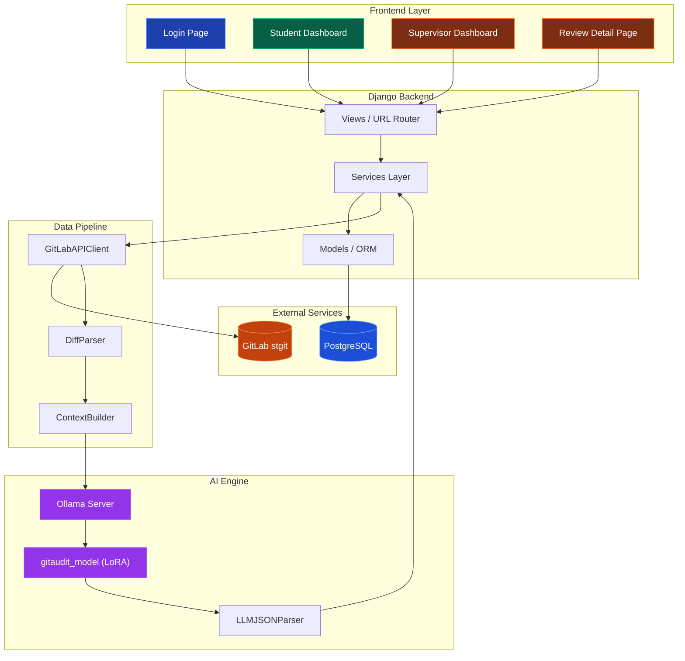

<p align="center">
  
</p>

<h1 align="center">GitAudit — AI-Powered Git Repository Audit Platform</h1>

<p align="center">
  <em>Intelligent progress tracking and code audit system for undergraduate final-year projects</em>
</p>

<p align="center">
  
  
  
  
  
  
</p>


## 📋 Table of Contents

- [Background & Motivation](#-background--motivation)
- [Tech Stack](#-tech-stack)
- [Core Features](#-core-features)
- [System Architecture](#-system-architecture)
- [Project Structure](#-project-structure)
- [Getting Started](#-getting-started)
- [Testing & Quality Assurance](#-testing--quality-assurance)
- [Development Timeline & Roadmap](#-development-timeline--roadmap)
- [Acknowledgements](#-acknowledgements)

---

## 🎯 Background & Motivation

### Problem Statement

In the School of Computing Science at the University of Glasgow, the **TRACKER PPT** is a bi-weekly progress report that Level 4 IT Project students must submit to their supervisors. It records milestone completion, meeting agendas, coding progress, and dissertation status. The current workflow suffers from two critical pain points:

| Pain Point | Description | Impact |
|------------|-------------|--------|
| **Student: Tedious Reporting** | Students must manually edit TRACKER PPTs — filling in progress items, pasting code screenshots, and compiling meeting agendas — a time-consuming and error-prone process | 30-60 minutes every two weeks |
| **Supervisor: Inefficient Review** | Supervisors must log into GitLab for each student individually, manually browse commit histories, inspect code diffs, and judge development authenticity | Enormous workload when supervising 10+ students |

### Solution

**GitAudit** addresses both pain points through three technical pillars:

1. **Git API Automation** — Pulls commit and diff data directly from GitLab, replacing manual screenshots
2. **Dual-Role Dashboards** — Provides tailored web interfaces for both students and supervisors, replacing PPT files
3. **Local LLM-Powered Audit** — Uses a fine-tuned large language model to automatically analyse code change quality, assisting supervisors in decision-making

---

## 🛠 Tech Stack

### Backend

| Technology | Version | Purpose |
|------------|---------|---------|
| [Python](https://www.python.org/) | 3.12+ | Primary programming language |
| [Django](https://www.djangoproject.com/) | 6.0 | Web application framework (MVC) |
| [PostgreSQL](https://www.postgresql.org/) | 16 | Production database |
| [python-dotenv](https://github.com/theskumar/python-dotenv) | latest | Environment variable management |

### Frontend

| Technology | Version | Purpose |
|------------|---------|---------|
| [Tailwind CSS](https://tailwindcss.com/) | 3.4 (CDN) | Responsive UI styling framework |
| [Chart.js](https://www.chartjs.org/) | latest | Data visualisation (LOC charts, radar charts) |
| [Google Fonts (Inter)](https://fonts.google.com/specimen/Inter) | — | Typography |
| Django Template Engine | built-in | Server-side template rendering |

### AI / LLM Engine

| Technology | Purpose |
|------------|---------|
| [Ollama](https://ollama.com/) | Local LLM inference server |
| [Llama 3](https://llama.meta.com/) (LoRA fine-tuned) | Base model, SFT fine-tuned as `gitaudit_model` |
| [Unsloth](https://github.com/unslothai/unsloth) | LoRA fine-tuning framework |
| Custom Alpaca Dataset | Built from real GitLab commit-diff pairs |

### API Integration

| Technology | Purpose |
|------------|---------|
| [GitLab REST API v4](https://docs.gitlab.com/ee/api/) | Commit / diff data retrieval |
| [Requests](https://docs.python-requests.org/) | HTTP client library |

### Testing & Quality

| Tool | Purpose |
|------|---------|
| [pytest](https://docs.pytest.org/) + [pytest-django](https://pytest-django.readthedocs.io/) | Unit testing framework |
| [pytest-mock](https://github.com/pytest-dev/pytest-mock) | Mock / stub utilities |
| [factory_boy](https://factoryboy.readthedocs.io/) | Test data factories |
| [pytest-cov](https://github.com/pytest-dev/pytest-cov) | Code coverage reporting |
| [Axe-core](https://github.com/dequelabs/axe-core) + [Playwright](https://playwright.dev/) | Accessibility testing |
| [Pylint](https://pylint.pycqa.org/) | Code quality analysis (PEP-8) |
| [Radon](https://radon.readthedocs.io/) | Cyclomatic complexity analysis |
| [Bandit](https://bandit.readthedocs.io/) | Security vulnerability scanning |

---

## ⭐ Core Features

### 1. GitLab API Automated Data Pipeline

```
GitLab (stgit.dcs.gla.ac.uk) ──► GitLabAPIClient ──► DiffParser ──► DailyGitAudit
```

- **Auto-Pagination & Rate Limit Retry**: Encapsulated `GitLabAPIClient` with pagination traversal and 429 exponential backoff
- **Commit & Diff Fetching**: Automatically retrieves student repository commits and code diffs within a specified date range
- **Daily Aggregation**: Groups commits and diffs by date, calculating daily LOC (Lines of Code) changes
- **Tier 1 Metrics**: Automatically computes CDR (Code Deletion Ratio), TSR (Test-to-Source Ratio), and anomaly detection flags

#### 📊 Training Dataset Visualisation

The LoRA fine-tuning training dataset was built from real GitLab commit-diff pairs. The charts below illustrate the data distribution characteristics:

<p align="center">
  
</p>
<p align="center"><em>Fig 1: Training set label distribution — PASS (82.9%) / WARN (11.4%) / REJECT (5.7%)</em></p>

<p align="center">
  
</p>
<p align="center"><em>Fig 2: File change count distribution across commits</em></p>

<p align="center">
  
</p>
<p align="center"><em>Fig 3: Commit message word frequency distribution and anomaly detection</em></p>

### 2. Dual-Role Dashboards

#### 🎓 Student Dashboard

| Module | Description |
|--------|-------------|
| Bi-Weekly Report Form | Structured input: completed work, design progress, prototype status, dissertation updates, meeting agenda |
| Milestone Tracker | Visual milestone status (Completed / On Track / Not Started) with interactive toggles |
| Evidence Upload | Image and screenshot uploads as proof of work |
| AI Audit Trigger | One-click Git audit generation — auto-fetches recent code changes and invokes LLM analysis |
| Report Submission Lock | Automatically locks after submission to prevent tampering |

#### 👨‍🏫 Supervisor Dashboard

| Module | Description |
|--------|-------------|
| Student Overview | Priority-sorted list of all supervised students with status badges |
| Detailed Review View | Full bi-weekly report content + AI audit results |
| LOC Change Charts | Chart.js-powered line charts for code additions/deletions |
| AI Status Override | Supervisors can manually override AI verdicts (Green → Yellow → Red) |
| Feedback & Verdict | Written feedback, next meeting scheduling, and approve/reject actions |

### 3. Local LLM Intelligent Audit Engine

```
Raw Diff ──► Prompt Builder ──► Ollama (gitaudit_model) ──► JSON Parser ──► Traffic Light
```

- **Model Fine-Tuning**: Based on Llama 3, fine-tuned with LoRA SFT using the Unsloth framework
- **Custom Training Dataset**: Built from real GitLab commit-diff pairs in Alpaca format (labelled with PASS/WARN/REJECT)
- **Structured JSON Output**: Enforces standardised JSON containing `status` and `summary` fields
- **Robust Parser**: `LLMJSONParser` handles common LLM hallucination patterns (Markdown wrapping, conversational filler text, etc.)
- **Graceful Degradation**: Falls back to `WARN` status when AI engine is unavailable, without disrupting the main workflow

---

## 🏗 System Architecture



### Data Flow

```
┌──────────────┐     REST API v4      ┌───────────────┐
│   GitLab     │ ◄──────────────────► │  GitLabAPI    │
│   (stgit)    │   commits / diffs    │  Client       │
└──────────────┘                      └───────┬───────┘
                                              │
                                              ▼
                                      ┌───────────────┐
                                      │  DiffParser   │
                                      │  (Tier 1)     │
                                      └───────┬───────┘
                                              │
                     ┌────────────────────────┤
                     ▼                        ▼
             ┌───────────────┐        ┌───────────────┐
             │  PostgreSQL   │        │  Ollama LLM   │
             │  (Persistence)│        │  (Analysis)   │
             └───────┬───────┘        └───────┬───────┘
                     │                        │
                     ▼                        ▼
             ┌─────────────────────────────────────────┐
             │          Django Views / Templates        │
             │   Student Dashboard  │  Supervisor Dash. │
             └─────────────────────────────────────────┘
```

---

## 📁 Project Structure

```
gitaudit/
├── config/                      # Django project configuration
│   ├── settings.py              # Global settings (database, middleware, etc.)
│   ├── urls.py                  # Root URL configuration
│   ├── wsgi.py                  # WSGI deployment entrypoint
│   └── asgi.py                  # ASGI deployment entrypoint
│
├── auditor/                     # Core application
│   ├── models.py                # Data models (7 models)
│   ├── views.py                 # View logic (login, dual dashboards, review)
│   ├── urls.py                  # App-level URL routing
│   ├── services.py              # Business logic layer (data fetching + LLM calls)
│   ├── gitlab_client.py         # GitLab REST API v4 client
│   ├── diff_parser.py           # Diff parser + Tier 1 metric computation
│   ├── context_builder.py       # LLM prompt constructor
│   ├── llm_parser.py            # LLM output JSON parser
│   ├── templates/auditor/       # Django HTML templates
│   │   ├── base.html            # Base template (navbar, toast notifications)
│   │   ├── login.html           # Login page
│   │   ├── student_dashboard.html  # Student dashboard
│   │   ├── teacher_dashboard.html  # Supervisor dashboard
│   │   └── teacher_student_review.html  # Review detail page
│   ├── static/                  # Static assets (CSS / images)
│   └── tests/                   # Test suite
│       ├── factories.py         # factory_boy test data factories
│       ├── test_usability.py    # Usability tests
│       ├── test_gitlab_client.py  # GitLab client unit tests
│       ├── test_services.py     # Service layer unit tests
│       └── test_a11y.py         # Accessibility tests (Axe-core)
│
├── poc/                         # Proof of Concept module
│   ├── audit_service.py         # PoC Ollama audit service
│   └── gitlab_service.py        # PoC GitLab data fetching
│
├── Modelfile                    # Ollama model definition (LoRA fine-tune config)
├── build_dataset.py             # Build Alpaca training dataset from GitLab
├── fill_reviews.py              # Fill PASS/WARN/REJECT labels for training data
├── load_data.py                 # Batch import users & repositories from CSV
├── audit_project.py             # Comprehensive audit script (quality + security + complexity)
├── manage.py                    # Django management entry point
├── pytest.ini                   # pytest configuration
├── .env                         # Environment variables (database config)
└── .gitignore                   # Git ignore rules
```

---

## 🚀 Getting Started

### Prerequisites

- Python 3.12+
- PostgreSQL 16+
- [Ollama](https://ollama.com/) (optional, for AI audit features)

### Installation

```bash
# 1. Clone the repository
git clone https://stgit.dcs.gla.ac.uk/<your-repo>/gitaudit.git
cd gitaudit

# 2. Create a virtual environment
python -m venv venv
source venv/bin/activate  # Windows: venv\Scripts\activate

# 3. Install dependencies
pip install django psycopg2-binary python-dotenv requests

# 4. Configure environment variables
# Edit the .env file with your database credentials
DB_NAME=gitaudit
DB_USER=postgres
DB_PASSWORD=your_password
DB_HOST=localhost
DB_PORT=5432

# 5. Run database migrations
python manage.py migrate

# 6. Import test data (optional)
python load_data.py

# 7. Start the development server
python manage.py runserver
```

### Configure AI Audit Engine (Optional)

```bash
# 1. Install Ollama
# See https://ollama.com/download

# 2. Import the fine-tuned model
ollama create gitaudit_model -f Modelfile

# 3. Start the Ollama service
ollama serve
```

---

## 🧪 Testing & Quality Assurance

### Running Tests

```bash
# Run all tests
pytest -v

# Run tests with code coverage
pytest --cov=auditor --cov-report=html -v

# Run the comprehensive project audit (Pylint + Radon + Bandit + pytest + Axe-core)
python audit_project.py
```

### Test Coverage

| Test Category | File | Scope |
|---------------|------|-------|
| Usability Tests | `test_usability.py` | Login flow, dashboard rendering, report submission, review page |
| API Client Tests | `test_gitlab_client.py` | Request success/failure, rate limit retry, pagination, commit/diff fetching |
| Service Layer Tests | `test_services.py` | Data aggregation, LLM calls, JSON parsing fallback, network error handling |
| Accessibility Tests | `test_a11y.py` | Login page, student/supervisor dashboard WCAG compliance |

### Automated Audit Dimensions

The comprehensive audit script `audit_project.py` covers **5 dimensions** and outputs a visual HTML report:

| Dimension | Tool | Metric |
|-----------|------|--------|
| Usability | pytest | Full test pass rate |
| Code Quality | Pylint | PEP-8 compliance score (/10) |
| Code Complexity | Radon | Average cyclomatic complexity (CC) |
| Security | Bandit | High/medium/low severity issue count |
| Accessibility | Axe-core | WCAG violation count |

### Test Result Screenshots

#### Code Coverage Report (pytest-cov)

<p align="center">
  
</p>
<p align="center"><em>Fig 4: Code coverage report — 71% total coverage, 773 statements / 223 missed</em></p>

#### Comprehensive Project Audit Report (audit_project.py)

<p align="center">
  
</p>
<p align="center"><em>Fig 5: 5-Dimension audit scores — Usability 100 · Code Quality 45 · Complexity 100 · Security 100 · Accessibility 60</em></p>

---

## 📅 Development Timeline & Roadmap

> Project start date: 2026-07-07 ｜ Total commits: 57 ｜ Ongoing

### Phase 1: Proof of Concept (Week 1-2)

```
✅ Completed  |  2026-07-07 ~ 2026-07-20
```

| Task | Status |
|------|--------|
| Django project initialisation with SQLite database | ✅ |
| GitLab data fetching PoC + mock fixtures | ✅ |
| Ollama audit engine PoC + defensive circuit | ✅ |
| VPN environment push notification testing | ✅ |

### Phase 2: GitLab API Data Pipeline (Week 3-4)

```
✅ Completed  |  2026-07-21 ~ 2026-08-03
```

| Task | Status |
|------|--------|
| GitLabAPIClient implementation (pagination, rate limit retry) | ✅ |
| DiffParser implementation (LOC, CDR, TSR, anomaly detection) | ✅ |
| Data model design & migration (Repository, CommitLog, AuditSession) | ✅ |
| Unit test coverage | ✅ |

### Phase 3: LLM Fine-Tuning & Deployment (Week 4-5)

```
✅ Completed  |  2026-08-01 ~ 2026-08-10
```

| Task | Status |
|------|--------|
| Build Alpaca-format training dataset from GitLab | ✅ |
| LoRA SFT fine-tuning with Unsloth framework | ✅ |
| Modelfile configuration & Ollama deployment | ✅ |
| LLMJSONParser robustness handling | ✅ |
| Strict JSON output strategy + hallucination suppression | ✅ |

### Phase 4: Dual Dashboard Development (Week 5-7)

```
✅ Completed  |  2026-08-05 ~ 2026-08-20
```

| Task | Status |
|------|--------|
| Authentication system (role-based routing) | ✅ |
| Student dashboard (report form, milestones, evidence upload) | ✅ |
| One-click AI audit trigger + results display | ✅ |
| Supervisor dashboard (student list, priority sorting) | ✅ |
| Review detail page (AI status override, feedback, verdict) | ✅ |
| LOC chart visualisation (Chart.js) | ✅ |
| Report submission locking mechanism | ✅ |
| Database migration to PostgreSQL | ✅ |

### Phase 5: Testing & Quality Assurance (Week 7-8)

```
✅ Completed  |  2026-08-18 ~ 2026-08-26
```

| Task | Status |
|------|--------|
| Usability test suite (Django TestCase) | ✅ |
| GitLab client unit tests (Mock + rate limit testing) | ✅ |
| Service layer unit tests (LLM parse fallback testing) | ✅ |
| Accessibility tests (Axe-core + Playwright) | ✅ |
| Comprehensive audit script (5-dimension HTML report) | ✅ |
| Code coverage reporting | ✅ |

### 🔮 Future Roadmap

| Feature | Description | Priority |
|---------|-------------|----------|
| Multi-Period Reports | Auto-detect current teaching week and generate matching templates | 🔴 High |
| Webhook Trigger | Replace manual triggers with GitLab webhook-driven automatic audits | 🔴 High |
| Email Notifications | Auto-send emails on report submission/approval | 🟡 Medium |
| Batch Review | Allow supervisors to review multiple student reports at once | 🟡 Medium |
| Historical Trend Analysis | Cross-period LOC and commit trend comparison | 🟡 Medium |
| Cloud Deployment | Docker containerisation + CI/CD pipeline | 🟢 Low |
| LLM Online Learning | Continuously optimise the model based on supervisor override records | 🟢 Low |

---

## 🙏 Acknowledgements

This project is a Level 4 IT Project dissertation for the School of Computing Science, University of Glasgow (Academic Year 2025-2026).

---

<p align="center">
  <sub>Built with ❤️ using Django, GitLab API, and Ollama</sub>
</p>
