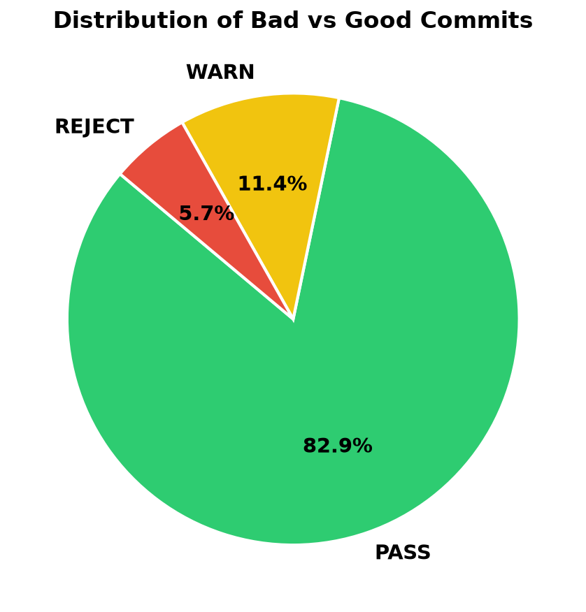
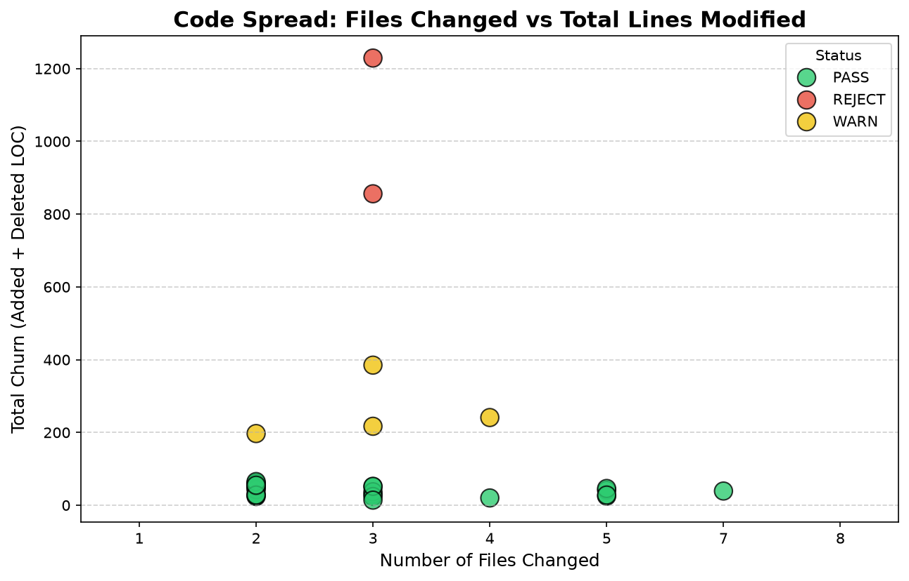
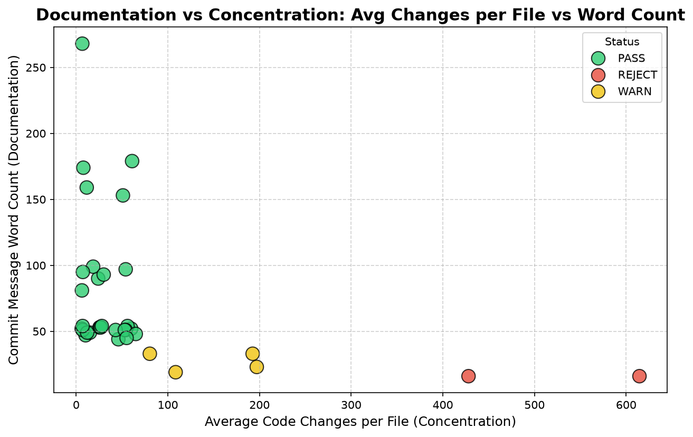
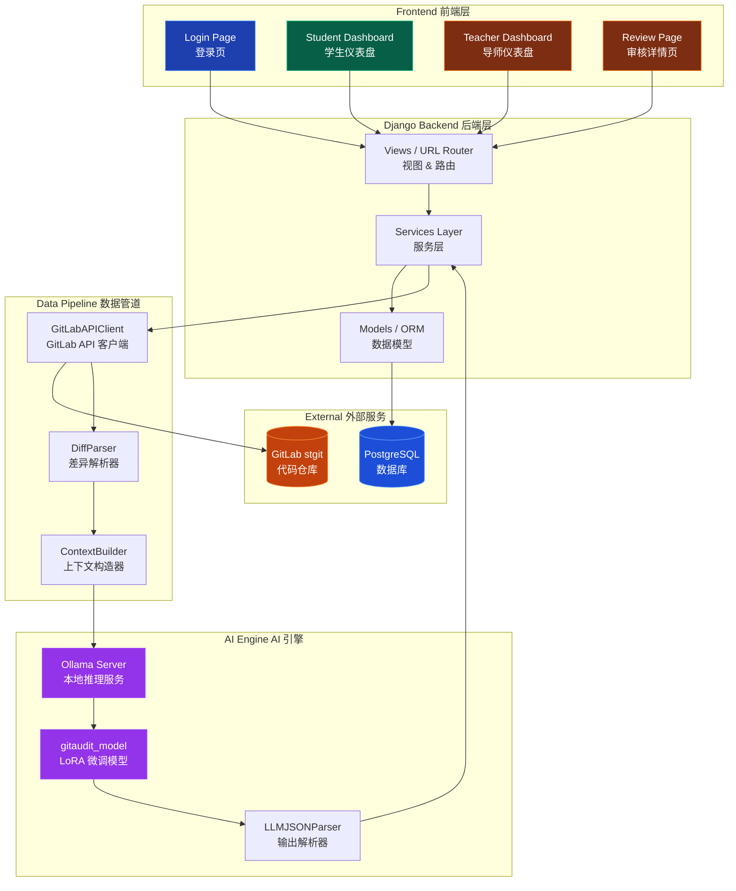
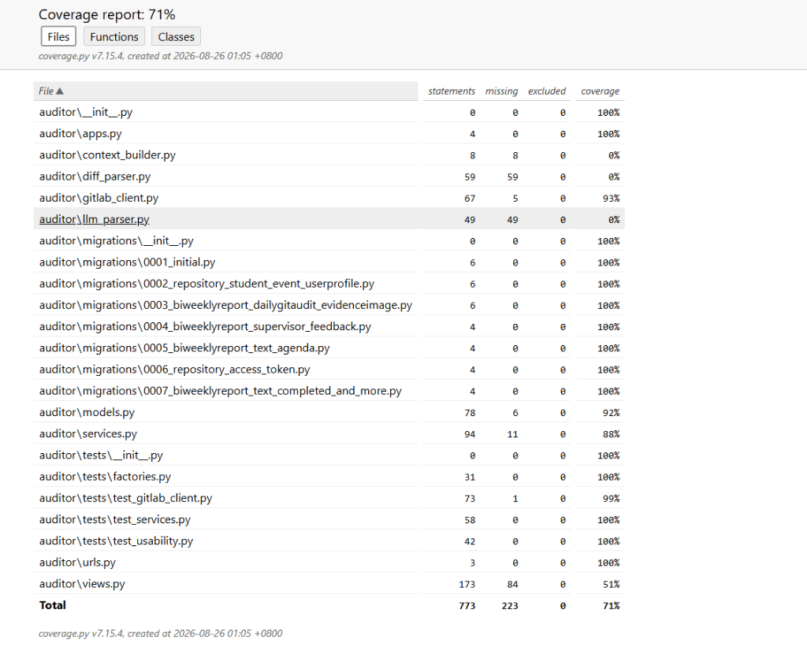
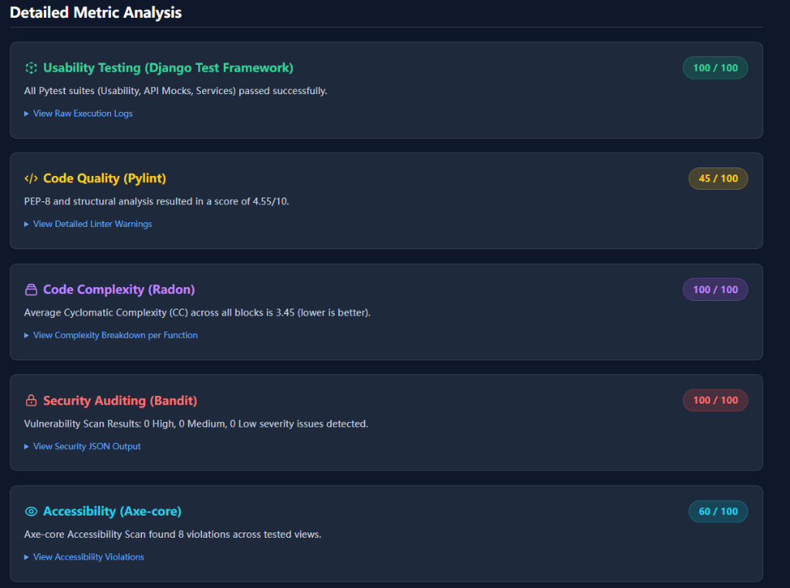

<p align="center">
  
</p>

<h1 align="center">GitAudit — 基于 AI 的 Git 仓库自动审计平台</h1>

<p align="center">
  <em>为计算机学院毕业设计项目打造的智能化进度追踪与代码审计系统</em>
</p>

<p align="center">
  
  
  
  
  
  
</p>

---

> 🌐 [English Version](README_EN.md)

---

## 📋 目录

- [项目背景与目的](#-项目背景与目的)
- [技术栈](#-技术栈)
- [核心功能](#-核心功能)
- [系统架构](#-系统架构)
- [项目结构](#-项目结构)
- [快速开始](#-快速开始)
- [测试与质量保障](#-测试与质量保障)
- [开发周期与迭代计划](#-开发周期与迭代计划)
- [致谢](#-致谢)

---

## 🎯 项目背景与目的

### 痛点分析

在英国格拉斯哥大学计算机学院的毕业设计 (Level 4 IT Project) 流程中，**TRACKER PPT** 是学生每两周提交的进度汇报文件，用于记录里程碑完成情况、会议议程、代码进展及论文写作状况。现有流程存在两大核心痛点：

| 痛点 | 描述 | 影响 |
|------|------|------|
| **学生端：填写繁琐** | 学生需手动编辑 TRACKER PPT，逐项填写进度、粘贴代码截图、整理会议议程，耗时且容易遗漏 | 每两周需花费 30-60 分钟整理材料 |
| **导师端：审核低效** | 导师需要逐个学生登录 GitLab，手动浏览提交记录、查看代码差异，人工判断是否真实开发 | 督导 10+ 名学生时，审核工作量巨大 |

### 解决方案

**GitAudit** 通过三大技术手段解决上述痛点：

1. **Git API 自动化数据采集** — 直接从 GitLab 拉取 commit 和 diff 数据，取代手动截图
2. **双端 Dashboard** — 为学生和导师分别提供定制化的 Web 界面，取代 PPT 文件
3. **本地 LLM 智能审计** — 使用微调后的大语言模型自动分析代码变更质量，辅助导师决策

---

## 🛠 技术栈

### 后端框架

| 技术 | 版本 | 用途 |
|------|------|------|
| [Python](https://www.python.org/) | 3.12+ | 主要编程语言 |
| [Django](https://www.djangoproject.com/) | 6.0 | Web 应用框架，MVC 架构 |
| [PostgreSQL](https://www.postgresql.org/) | 16 | 生产数据库 |
| [python-dotenv](https://github.com/theskumar/python-dotenv) | latest | 环境变量管理 |

### 前端技术

| 技术 | 版本 | 用途 |
|------|------|------|
| [Tailwind CSS](https://tailwindcss.com/) | 3.4 (CDN) | 响应式 UI 样式框架 |
| [Chart.js](https://www.chartjs.org/) | latest | 数据可视化（LOC 折线图、雷达图） |
| [Google Fonts (Inter)](https://fonts.google.com/specimen/Inter) | — | 排版字体 |
| Django Template Engine | 内置 | 服务端模板渲染 |

### AI / LLM 引擎

| 技术 | 用途 |
|------|------|
| [Ollama](https://ollama.com/) | 本地 LLM 推理服务器 |
| [Llama 3](https://llama.meta.com/) (LoRA 微调) | 基座模型，经 SFT 微调为 `gitaudit_model` |
| [Unsloth](https://github.com/unslothai/unsloth) | LoRA 微调训练框架 |
| 自定义 Alpaca 数据集 | 基于真实 GitLab commit-diff 对构建 |

### API 集成

| 技术 | 用途 |
|------|------|
| [GitLab REST API v4](https://docs.gitlab.com/ee/api/) | Commit / Diff 数据拉取 |
| [Requests](https://docs.python-requests.org/) | HTTP 客户端 |

### 测试与质量

| 工具 | 用途 |
|------|------|
| [pytest](https://docs.pytest.org/) + [pytest-django](https://pytest-django.readthedocs.io/) | 单元测试框架 |
| [pytest-mock](https://github.com/pytest-dev/pytest-mock) | Mock / Stub 工具 |
| [factory_boy](https://factoryboy.readthedocs.io/) | 测试数据工厂 |
| [pytest-cov](https://github.com/pytest-dev/pytest-cov) | 代码覆盖率 |
| [Axe-core](https://github.com/dequelabs/axe-core) + [Playwright](https://playwright.dev/) | 无障碍访问性测试 |
| [Pylint](https://pylint.pycqa.org/) | 代码质量分析 (PEP-8) |
| [Radon](https://radon.readthedocs.io/) | 圈复杂度分析 |
| [Bandit](https://bandit.readthedocs.io/) | 安全漏洞扫描 |

---

## ⭐ 核心功能

### 1. GitLab API 自动化数据管道

```
GitLab (stgit.dcs.gla.ac.uk) ──► GitLabAPIClient ──► DiffParser ──► DailyGitAudit
```

- **自动分页 & 限流重试**：封装 `GitLabAPIClient`，支持 API 分页遍历和 429 限流指数退避
- **Commit 与 Diff 拉取**：按时间范围自动获取学生仓库的 commit 列表和每次提交的代码差异
- **按日聚合**：将 commit 和 diff 数据按日期聚合，计算每日 LOC（代码行数）变化
- **Tier 1 指标计算**：自动计算 CDR（代码删除比）、TSR（测试覆盖比）、异常检测标记

#### 📊 训练数据集可视化

基于真实 GitLab 仓库提取的 commit-diff 对构建的 LoRA 微调训练数据集，以下图表展示了数据分布特征：

<p align="center">
  
</p>
<p align="center"><em>图 1：训练集标签分布 — PASS (82.9%) / WARN (11.4%) / REJECT (5.7%)</em></p>

<p align="center">
  
</p>
<p align="center"><em>图 2：各 Commit 的文件变更数量分布</em></p>

<p align="center">
  
</p>
<p align="center"><em>图 3：Commit Message 词频分布与异常检测</em></p>

### 2. 双端 Dashboard

#### 🎓 学生端 Dashboard

| 功能模块 | 描述 |
|----------|------|
| 双周报告表单 | 结构化填写：已完成工作、设计进展、原型状态、论文进度、会议议程 |
| 里程碑追踪器 | 可视化里程碑状态（已完成 / 进行中 / 未开始），支持交互式状态切换 |
| 证据上传 | 支持图片、截图上传作为工作证明 |
| AI 审计触发 | 一键生成 Git 审计报告，自动拉取近期代码变更并调用 LLM 分析 |
| 报告提交锁定 | 提交后自动锁定，防止篡改 |

#### 👨‍🏫 导师端 Dashboard

| 功能模块 | 描述 |
|----------|------|
| 学生列表总览 | 按审核优先级排序显示所有指导学生，状态标签一目了然 |
| 详细审核视图 | 查看学生双周报告全部内容 + AI 审计结果 |
| LOC 变化图表 | 基于 Chart.js 的代码增删可视化折线图 |
| AI 状态覆写 | 导师可手动修正 AI 判定结果（绿 → 黄 → 红） |
| 反馈与裁决 | 填写反馈意见、安排下次会议时间、通过/打回报告 |

### 3. 本地 LLM 智能审计引擎

```
原始 Diff ──► Prompt 构建 ──► Ollama (gitaudit_model) ──► JSON 解析 ──► 红黄绿交通灯
```

- **模型微调**：基于 Llama 3，使用 Unsloth 框架进行 LoRA SFT 微调
- **自定义训练集**：从真实 GitLab commit-diff 对中构建 Alpaca 格式数据集（含 PASS/WARN/REJECT 标注）
- **结构化 JSON 输出**：强制模型输出标准化 JSON，包含 `status` 和 `summary`
- **健壮的解析器**：`LLMJSONParser` 处理 LLM 常见幻觉模式（Markdown 包裹、对话填充文本等）
- **优雅降级**：AI 引擎不可用时自动回退为 `WARN` 状态，不影响主流程

---

## 🏗 系统架构



### 数据流详解

```
┌──────────────┐     REST API v4      ┌───────────────┐
│   GitLab     │ ◄──────────────────► │  GitLabAPI    │
│   (stgit)    │   commits / diffs    │  Client       │
└──────────────┘                      └───────┬───────┘
                                              │
                                              ▼
                                      ┌───────────────┐
                                      │  DiffParser   │
                                      │  (Tier 1 指标) │
                                      └───────┬───────┘
                                              │
                     ┌────────────────────────┤
                     ▼                        ▼
             ┌───────────────┐        ┌───────────────┐
             │  PostgreSQL   │        │  Ollama LLM   │
             │  (数据持久化)  │        │  (智能分析)    │
             └───────┬───────┘        └───────┬───────┘
                     │                        │
                     ▼                        ▼
             ┌─────────────────────────────────────────┐
             │          Django Views / Templates        │
             │   Student Dashboard  │  Teacher Dashboard│
             └─────────────────────────────────────────┘
```

---

## 📁 项目结构

```
gitaudit/
├── config/                      # Django 项目配置
│   ├── settings.py              # 全局设置（数据库、中间件等）
│   ├── urls.py                  # 根路由配置
│   ├── wsgi.py                  # WSGI 部署入口
│   └── asgi.py                  # ASGI 部署入口
│
├── auditor/                     # 核心应用
│   ├── models.py                # 数据模型（7 个模型）
│   ├── views.py                 # 视图逻辑（登录、双端 Dashboard、审核）
│   ├── urls.py                  # 应用路由
│   ├── services.py              # 业务逻辑层（数据拉取 + LLM 调用）
│   ├── gitlab_client.py         # GitLab REST API v4 客户端
│   ├── diff_parser.py           # Diff 解析器 + Tier 1 指标计算
│   ├── context_builder.py       # LLM 提示词构建器
│   ├── llm_parser.py            # LLM 输出 JSON 解析器
│   ├── templates/auditor/       # Django HTML 模板
│   │   ├── base.html            # 基础模板（导航栏、Toast 通知）
│   │   ├── login.html           # 登录页
│   │   ├── student_dashboard.html  # 学生仪表盘
│   │   ├── teacher_dashboard.html  # 导师仪表盘
│   │   └── teacher_student_review.html  # 审核详情页
│   ├── static/                  # 静态资源 (CSS / 图片)
│   └── tests/                   # 测试套件
│       ├── factories.py         # factory_boy 测试工厂
│       ├── test_usability.py    # 可用性测试
│       ├── test_gitlab_client.py  # GitLab 客户端单元测试
│       ├── test_services.py     # 服务层单元测试
│       └── test_a11y.py         # 无障碍访问性测试 (Axe-core)
│
├── poc/                         # 概念验证 (PoC) 模块
│   ├── audit_service.py         # PoC 阶段 Ollama 审计服务
│   └── gitlab_service.py        # PoC 阶段 GitLab 数据拉取
│
├── Modelfile                    # Ollama 模型定义文件（LoRA 微调配置）
├── build_dataset.py             # 从 GitLab 构建 Alpaca 训练数据集
├── fill_reviews.py              # 为训练集填充 PASS/WARN/REJECT 标注
├── load_data.py                 # 从 CSV 批量导入用户与仓库数据
├── audit_project.py             # 综合项目审计脚本（质量 + 安全 + 复杂度）
├── manage.py                    # Django 管理入口
├── pytest.ini                   # pytest 配置
├── .env                         # 环境变量（数据库配置）
└── .gitignore                   # Git 忽略规则
```

---

## 🚀 快速开始

### 前置依赖

- Python 3.12+
- PostgreSQL 16+
- [Ollama](https://ollama.com/)（可选，用于 AI 审计功能）

### 安装步骤

```bash
# 1. 克隆仓库
git clone https://stgit.dcs.gla.ac.uk/<your-repo>/gitaudit.git
cd gitaudit

# 2. 创建虚拟环境
python -m venv venv
source venv/bin/activate  # Windows: venv\Scripts\activate

# 3. 安装依赖
pip install django psycopg2-binary python-dotenv requests

# 4. 配置环境变量
# 编辑 .env 文件，设置数据库连接信息
DB_NAME=gitaudit
DB_USER=postgres
DB_PASSWORD=your_password
DB_HOST=localhost
DB_PORT=5432

# 5. 数据库迁移
python manage.py migrate

# 6. 导入测试数据（可选）
python load_data.py

# 7. 启动开发服务器
python manage.py runserver
```

### 配置 AI 审计引擎（可选）

```bash
# 1. 安装 Ollama
# 参见 https://ollama.com/download

# 2. 导入微调模型
ollama create gitaudit_model -f Modelfile

# 3. 启动 Ollama 服务
ollama serve
```

---

## 🧪 测试与质量保障

### 运行测试

```bash
# 运行全部测试
pytest -v

# 运行测试 + 代码覆盖率
pytest --cov=auditor --cov-report=html -v

# 运行综合项目审计（Pylint + Radon + Bandit + pytest + Axe-core）
python audit_project.py
```

### 测试覆盖

| 测试类别 | 文件 | 覆盖范围 |
|----------|------|----------|
| 可用性测试 | `test_usability.py` | 登录流程、Dashboard 渲染、报告提交、审核页面 |
| API 客户端测试 | `test_gitlab_client.py` | 请求成功/失败、限流重试、分页、commit/diff 拉取 |
| 服务层测试 | `test_services.py` | 数据聚合、LLM 调用、JSON 解析回退、网络错误处理 |
| 无障碍测试 | `test_a11y.py` | 登录页、学生/导师 Dashboard 的 WCAG 合规性 |

### 自动化审计维度

综合审计脚本 `audit_project.py` 覆盖 **5 个维度**，输出可视化 HTML 报告：

| 维度 | 工具 | 指标 |
|------|------|------|
| 可用性 | pytest | 全部测试通过率 |
| 代码质量 | Pylint | PEP-8 合规评分 (/10) |
| 代码复杂度 | Radon | 平均圈复杂度 (CC) |
| 安全性 | Bandit | 高/中/低严重级别漏洞数 |
| 无障碍 | Axe-core | WCAG 违规数 |

### 测试结果截图

#### 代码覆盖率报告 (pytest-cov)

<p align="center">
  
</p>
<p align="center"><em>图 4：代码覆盖率报告 — 总覆盖率 71%，773 条语句 / 223 条未覆盖</em></p>

#### 综合项目审计报告 (audit_project.py)

<p align="center">
  
</p>
<p align="center"><em>图 5：综合审计 5 维度评分 — 可用性 100 · 代码质量 45 · 复杂度 100 · 安全性 100 · 无障碍 60</em></p>

---

## 📅 开发周期与迭代计划

> 项目开始日期：2026-07-07 ｜ 总提交数：57 ｜ 持续至今

### Phase 1：概念验证 (Week 1-2)

```
✅ 完成  |  2026-07-07 ~ 2026-07-20
```

| 任务 | 状态 |
|------|------|
| Django 项目初始化，SQLite 数据库搭建 | ✅ |
| GitLab 数据拉取 PoC + Mock Fixture | ✅ |
| Ollama 审计引擎 PoC + 防御性电路 | ✅ |
| VPN 环境推送通知测试 | ✅ |

### Phase 2：GitLab API 数据管道 (Week 3-4)

```
✅ 完成  |  2026-07-21 ~ 2026-08-03
```

| 任务 | 状态 |
|------|------|
| GitLabAPIClient 构建（分页、限流重试） | ✅ |
| DiffParser 构建（LOC、CDR、TSR、异常检测） | ✅ |
| 数据模型设计与迁移（Repository、CommitLog、AuditSession） | ✅ |
| 单元测试覆盖 | ✅ |

### Phase 3：LLM 微调与部署 (Week 4-5)

```
✅ 完成  |  2026-08-01 ~ 2026-08-10
```

| 任务 | 状态 |
|------|------|
| 从 GitLab 构建 Alpaca 格式训练数据集 | ✅ |
| 使用 Unsloth 框架进行 LoRA SFT 微调 | ✅ |
| Modelfile 配置与 Ollama 部署 | ✅ |
| LLMJSONParser 健壮性处理 | ✅ |
| 严格 JSON 输出策略 + 幻觉抑制 | ✅ |

### Phase 4：双端 Dashboard 开发 (Week 5-7)

```
✅ 完成  |  2026-08-05 ~ 2026-08-20
```

| 任务 | 状态 |
|------|------|
| 登录系统（基于角色的路由分发） | ✅ |
| 学生端 Dashboard（报告表单、里程碑、证据上传） | ✅ |
| 一键 AI 审计触发 + 结果展示 | ✅ |
| 导师端 Dashboard（学生列表、优先级排序） | ✅ |
| 审核详情页（AI 状态覆写、反馈、裁决） | ✅ |
| LOC 图表可视化（Chart.js） | ✅ |
| 报告提交锁定机制 | ✅ |
| 数据库迁移至 PostgreSQL | ✅ |

### Phase 5：测试与质量保障 (Week 7-8)

```
✅ 完成  |  2026-08-18 ~ 2026-08-26
```

| 任务 | 状态 |
|------|------|
| 可用性测试套件（Django TestCase） | ✅ |
| GitLab 客户端单元测试（Mock + 限流测试） | ✅ |
| 服务层单元测试（LLM 解析回退测试） | ✅ |
| 无障碍测试（Axe-core + Playwright） | ✅ |
| 综合审计脚本（5 维度 HTML 报告） | ✅ |
| 代码覆盖率报告 | ✅ |

### 🔮 未来迭代计划

| 计划 | 描述 | 优先级 |
|------|------|--------|
| 多周期报告 | 支持自动识别当前教学周次，生成对应模板 | 🔴 高 |
| Webhook 触发 | 替代手动触发，GitLab Webhook 推送时自动审计 | 🔴 高 |
| 邮件通知 | 报告提交/审核通过时自动发送邮件通知 | 🟡 中 |
| 批量审核 | 导师一键审核多名学生报告 | 🟡 中 |
| 历史趋势分析 | 跨周期 LOC/提交趋势对比 | 🟡 中 |
| 云端部署 | Docker 容器化 + CI/CD 自动部署 | 🟢 低 |
| LLM 在线学习 | 根据导师覆写记录持续优化模型 | 🟢 低 |

---

## 🙏 致谢

本项目为格拉斯哥大学计算机学院 2025-2026 学年 Level 4 IT Project 毕业设计项目。

---

<p align="center">
  <sub>Built with ❤️ using Django, GitLab API, and Ollama</sub>
</p>